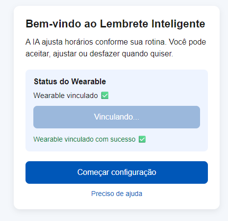

# Vitalis Care — Protótipo de Onboarding do Cuidador

Protótipo funcional desenvolvido para o Exercício 12. A aplicação apresenta uma tela de onboarding do cuidador integrada a um backend simples responsável por consultar e atualizar o status de um wearable.

## Estrutura do projeto

```text

├── backend/
│   ├── package.json
│   ├── server.js
│   └── routes/
│       └── wearable.js
└── frontend/
    └── index.html
```

## Como executar

### 1. Iniciar o backend

```bash
cd backend
npm install
npm start
```

O servidor será iniciado em:

```text
http://localhost:3000
```

### 2. Abrir o frontend

Abra o arquivo:

```text
frontend/index.html
```

diretamente no navegador ou utilize a extensão **Live Server** do VS Code.

> O backend precisa estar em execução para que o status do wearable seja carregado corretamente.

## Como funciona



1. O frontend consulta o status do wearable através de `GET /api/wearable-status`.
2. Se o wearable não estiver vinculado, o botão **"Vincular wearable agora"** é exibido.
3. Ao clicar no botão, o frontend envia uma requisição `POST /api/wearable/vincular`.
4. O backend altera o estado do wearable em memória.
5. A interface é atualizada e exibe **"Wearable vinculado ✅"**.
6. Uma mensagem de sucesso é apresentada ao usuário.

## Endpoints

| Método | Rota | Descrição |
|---|---|---|
| GET | `/api/wearable-status` | Retorna o status atual do wearable |
| POST | `/api/wearable/vincular` | Simula a vinculação do wearable |

## Limitações

Este projeto é apenas uma demonstração acadêmica e possui algumas limitações:

- Não possui autenticação ou autorização.
- Os dados são armazenados apenas em memória.
- Não existe persistência em banco de dados.
- A comunicação utiliza HTTP, sem HTTPS ou criptografia.
- Não possui tratamento estruturado de erros.
- Não possui sistema de logs.

Essas limitações devem ser resolvidas antes de uma utilização em produção.

## O que foi implementado

| Antes | Agora |
|---|---|
| Botão de vincular apenas exibia um `alert` | Botão chama `POST /api/wearable/vincular` |
| Status era fixo | Status é atualizado dinamicamente |
| Backend não possuía rota de escrita | Backend possui endpoint `POST` |
| Não havia feedback visual após a ação | Interface exibe mensagem de sucesso |

## Tecnologias utilizadas

- HTML
- JavaScript
- Node.js
- Express
- API REST