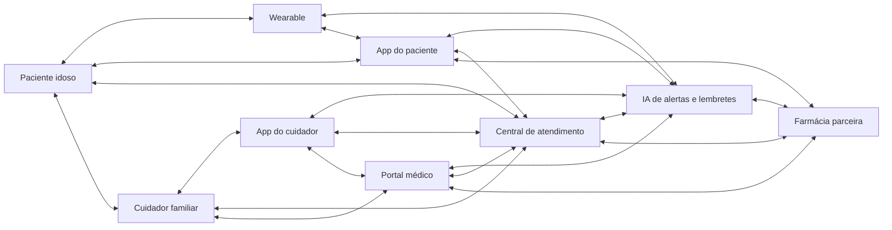
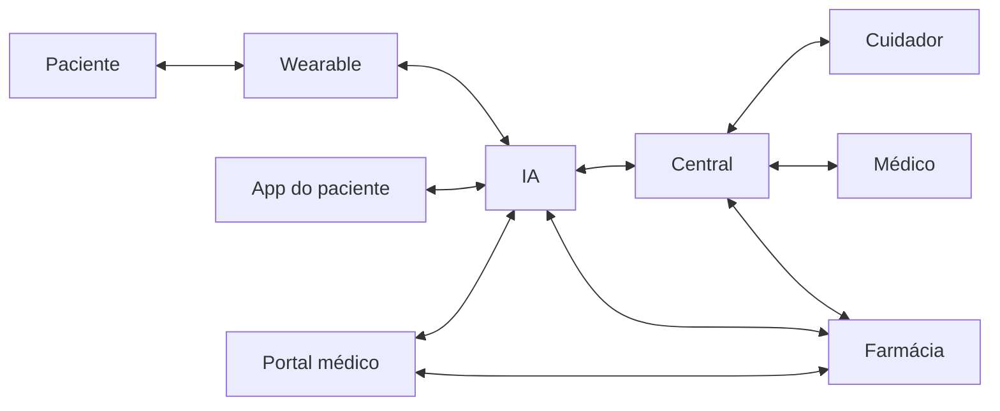
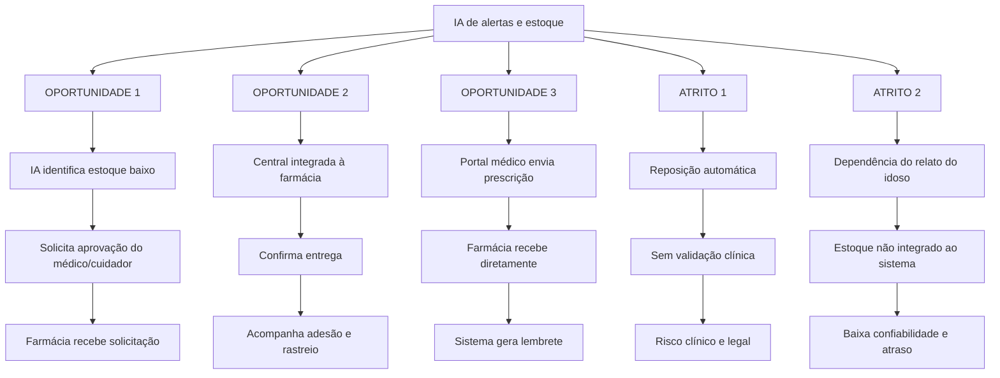
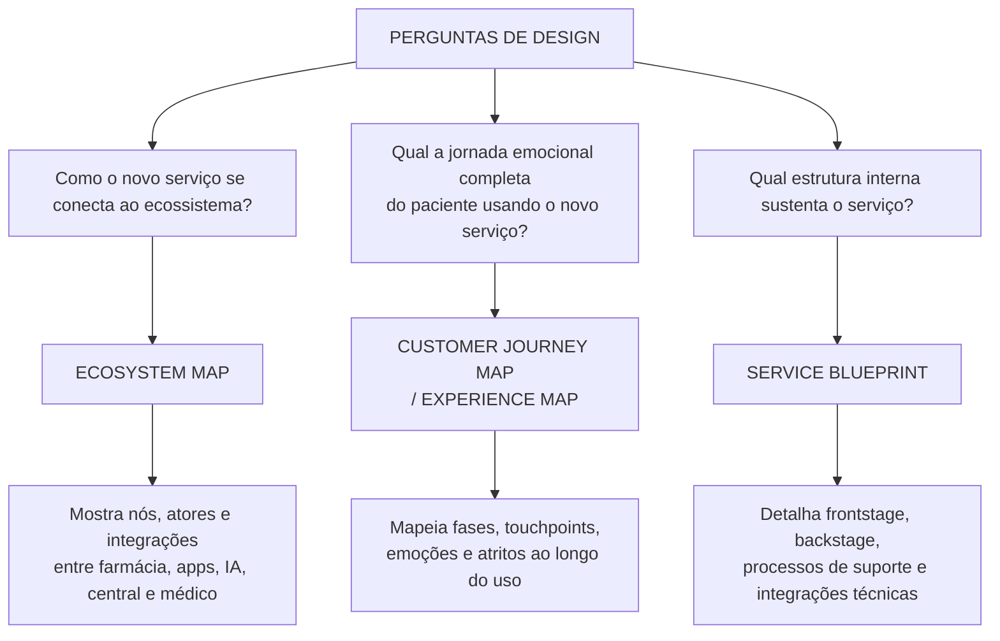

# Diagramas — Ecossistema e Integrações

## 1. Modelagem do Ecossistema

### Fluxo simplificado

## 2. Oportunidades de Integração e Pontos de Atrito

## 3. Mapa Adequado para Cada Pergunta de Design

