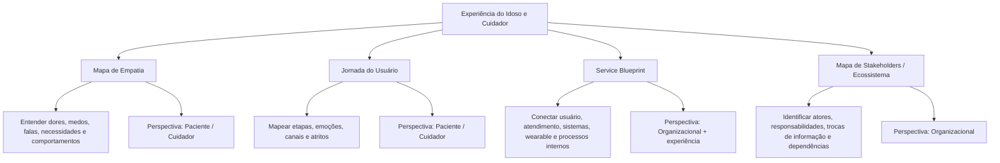

```mermaid
flowchart TD

    A[Experiência do Idoso e Cuidador]

    A --> B[Mapa de Empatia]
    A --> C[Jornada do Usuário]
    A --> D[Service Blueprint]
    A --> E[Mapa de Stakeholders / Ecossistema]

    B --> B1[Entender dores, medos, falas, necessidades e comportamentos]
    B --> B2[Perspectiva: Paciente / Cuidador]

    C --> C1[Mapear etapas, emoções, canais e atritos]
    C --> C2[Perspectiva: Paciente / Cuidador]

    D --> D1[Conectar usuário, atendimento, sistemas, wearable e processos internos]
    D --> D2[Perspectiva: Organizacional + experiência]

    E --> E1[Identificar atores, responsabilidades, trocas de informação e dependências]
    E --> E2[Perspectiva: Organizacional]
```
