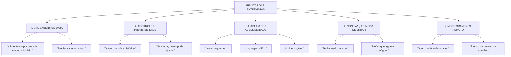
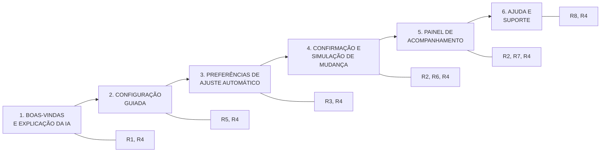

# Pesquisa, Requisitos e Arquitetura do Protótipo

## 1. Roteiro de Entrevista Exploratória — 6 Perguntas Abertas

1. Conte como foi a última vez que você precisou organizar os horários de medicação de alguém.
2. O que você faz hoje para não esquecer ou acompanhar os remédios?
3. Quais dificuldades você encontrou ao tentar configurar lembretes de medicação em um aplicativo?
4. O que você esperava que acontecesse quando abriu uma tela de lembrete pela primeira vez?
5. Como você percebe se um lembrete está funcionando bem ou não?
6. O que você faria se o horário de um lembrete mudasse sem aviso?

## 2. Respostas Simuladas de Três Participantes

| Participante | Perfil | Respostas resumidas |
|---|---|---|
| A | Cuidador jovem, alta familiaridade tech, mora com idoso | “Acho fácil configurar, mas tem muitas opções. Não entendo por que a IA mudou o horário. Quero controle e histórico.” |
| B | Cuidador idoso, baixa familiaridade, cuida da esposa | “Tenho medo de errar. As letras são pequenas e a linguagem é difícil. Prefiro que alguém configure para mim. Não entendo mudanças.” |
| C | Cuidador remoto, monitora por app | “Quero notificações claras e resumo de adesão. Se o horário mudar, preciso saber o motivo e poder ajustar.” |

## 3. Affinity Map — Grupos Temáticos

## 4. Requisitos de Interface Objetivos

| Código | Requisito |
|---|---|
| R1 | Explicar em linguagem simples o que é o lembrete inteligente e que o horário pode ser ajustado pela IA. |
| R2 | Exibir histórico/log de alterações com motivo do ajuste. |
| R3 | Permitir aceitar, recusar ou ajustar manualmente mudanças automáticas. |
| R4 | Usar botões grandes, alto contraste e linguagem acessível em todas as telas. |
| R5 | Oferecer configuração guiada passo a passo com valores padrão. |
| R6 | Enviar notificação clara quando o horário mudar, com ações “Entendi”, “Ajustar” e “Falar com suporte”. |
| R7 | Disponibilizar painel remoto com status de adesão e próximos lembretes. |
| R8 | Oferecer ajuda contextual e canal de suporte em cada etapa. |

## 5. Arquitetura do Protótipo

## 6. Detalhamento das Telas

| Ordem | Tela | Objetivo | Requisitos cobertos |
|---|---|---|---|
| 1 | Boas-vindas e explicação da IA | Alinhar modelo mental sobre o lembrete inteligente. | R1, R4 |
| 2 | Configuração guiada | Definir medicações, horários e dependentes. | R5, R4 |
| 3 | Preferências de ajuste automático | Permitir aceitar, recusar ou limitar ajustes da IA. | R3, R4 |
| 4 | Confirmação e simulação de mudança | Mostrar como será a notificação de mudança e o motivo. | R2, R6, R4 |
| 5 | Painel de acompanhamento | Exibir adesão, próximos lembretes e histórico. | R2, R7, R4 |
| 6 | Ajuda e suporte | Tirar dúvidas e contestar ajustes. | R8, R4 |
