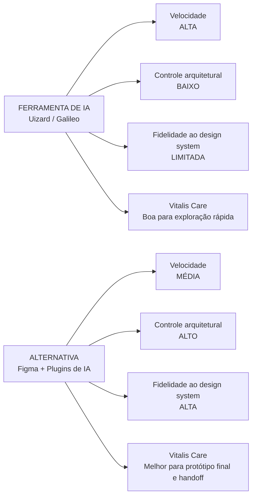

# Comparação de Ferramentas de Prototipação

## Comparativo

| Critério | Ferramenta usada (ex.: Uizard/Galileo) | Alternativa (ex.: Figma + plugins de IA) |
|---|---|---|
| Velocidade | Alta: gera tela a partir de imagem/prompt | Média: exige mais configuração manual |
| Controle arquitetural | Baixo: estrutura de componentes pouco editável | Alto: componentes, grids e design system controláveis |
| Fidelidade ao design system | Limitada | Alta, com bibliotecas próprias |
| Adequação ao caso Vitalis Care | Boa para exploração rápida | Melhor para protótipo final e handoff |

## Comparação Visual

