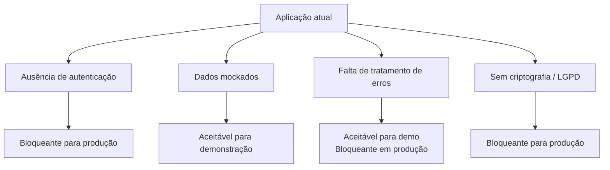
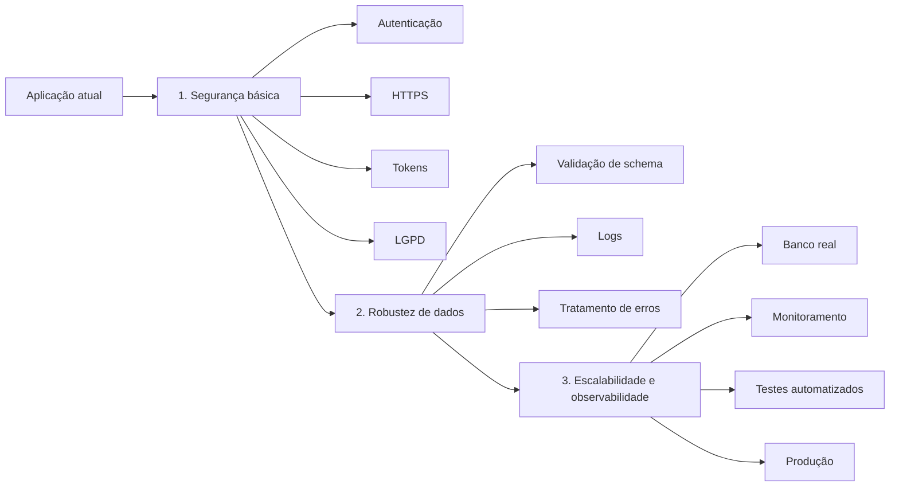

# Limitações Arquiteturais e Estratégia de Evolução

## 2. Limitações arquiteturais típicas

| Limitação | Evidência na aplicação | Classificação |
|---|---|---|
| Ausência de autenticação/autorização | Endpoint aberto, sem token ou login | Bloqueante para produção |
| Dados mockados sem validação | Backend retorna JSON fixo, sem schema | Aceitável para demonstração |
| Falta de tratamento de erro e logs | Sem try/catch, sem logging estruturado | Aceitável para demo; bloqueante em produção |
| Sem criptografia ou conformidade LGPD | Comunicação HTTP simples | Bloqueante para produção |

### Visão das limitações

## 3. Estratégia de evolução para produção

| Etapa | Ação | Limitação resolvida |
|---|---|---|
| 1. Segurança básica | Autenticação, HTTPS, tokens, LGPD | Ausência de autenticação e criptografia |
| 2. Robustez de dados | Validação de schema, logs, tratamento de erros | Dados mockados e falta de logs |
| 3. Escalabilidade e observabilidade | Banco real, monitoramento, testes automatizados | Falta de persistência e observabilidade |

### Roadmap de evolução

