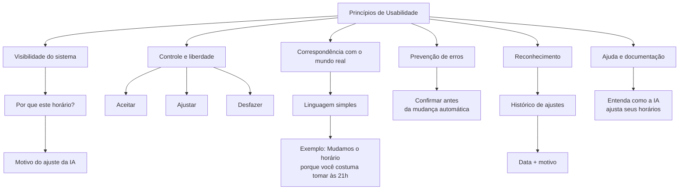

# Princípios de Usabilidade e Decisões de Interface

## Princípios aplicados

| Princípio | Decisão concreta de interface |
|---|---|
| Visibilidade do sistema | Mostrar na tela "Por que este horário?" com motivo do ajuste da IA. |
| Controle e liberdade do usuário | Botões "Aceitar", "Ajustar" e "Desfazer" em cada mudança de horário. |
| Correspondência com o mundo real | Linguagem simples: "Mudamos o horário porque você costuma tomar às 21h". |
| Prevenção de erros | Confirmação antes de aplicar mudança automática. |
| Reconhecimento em vez de memorização | Histórico visível de ajustes com data e motivo. |
| Ajuda e documentação | Link "Entenda como a IA ajusta seus horários" em cada tela. |

## Representação visual

