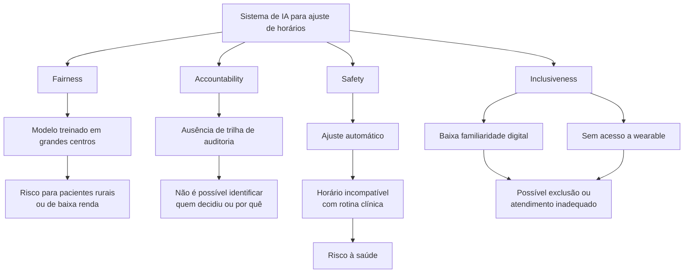
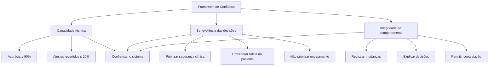

# Avaliação Ética e Framework de Confiança

## 1. Avaliação Fairness, Accountability, Safety e Inclusiveness

| Critério | Risco concreto |
|---|---|
| Fairness | Modelo treinado em grandes centros pode ajustar horários de forma inadequada para pacientes rurais ou de baixa renda. |
| Accountability | Sem trilha de auditoria, não se sabe quem decidiu nem por que o horário foi ajustado. |
| Safety | Ajuste automático pode levar a horários incompatíveis com a rotina clínica, causando risco à saúde. |
| Inclusiveness | Idosos com baixa familiaridade digital ou sem acesso a wearable podem ser excluídos ou mal atendidos. |

### Diagrama de riscos

## 2. Framework de confiança — 3 dimensões

| Dimensão | Critério observável |
|---|---|
| Capacidade técnica | Modelo com acurácia ≥ 90% e taxa de ajustes revertidos ≤ 10%. |
| Benevolência das decisões | Ajustes priorizam segurança clínica e rotina do paciente, não engajamento. |
| Integridade do comportamento | Sistema registra, explica e permite contestar toda mudança automática. |

### Diagrama do framework de confiança

