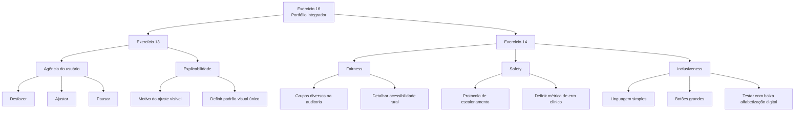

# Exercício 16 — Portfólio integrador

## 1. Mapa de experiência futura — alertas inteligentes

| Fase | Experiência desejada | Hipótese de solução validada |
|---|---|---|
| Lembrete de medicação | IA ajusta horário com explicação e opção de desfazer | Onboarding com explicabilidade e controle |
| Monitoramento contínuo | Wearable envia sinais sem alarme falso excessivo | Fila priorizada e override da IA |
| Detecção de queda | Alerta chega rápido ao cuidador e à central | Protocolo claro e timestamps por etapa |
| Teleconsulta | Paciente sabe exatamente o status da consulta | Status em tempo real na sala de espera |
| Pós-consulta | Resumo claro e acompanhamento contínuo | Resumo em linguagem simples + suporte |
| Coordenação de cuidados | Coordenador com ferramentas integradas e protocolo claro | Onboarding simulado e mentoria |

### Diagrama da experiência futura

```mermaid
flowchart LR
    A["Lembrete de medicação"]
    B["Monitoramento contínuo"]
    C["Detecção de queda"]
    D["Teleconsulta"]
    E["Pós-consulta"]
    F["Coordenação de cuidados"]

    A --> A1["IA ajusta horário<br/>+ explicação + desfazer"]
    A1 --> B

    B --> B1["Wearable envia sinais<br/>com menos alarmes falsos"]
    B1 --> C

    C --> C1["Alerta rápido<br/>ao cuidador e central"]
    C1 --> D

    D --> D1["Status da consulta<br/>em tempo real"]
    D1 --> E

    E --> E1["Resumo simples<br/>+ acompanhamento"]
    E1 --> F

    F --> F1["Ferramentas integradas<br/>+ protocolo claro"]
```

## 3. Alinhamento com objetivos dos Exercícios 13 e 14

| Objetivo | Alinhamento | Inconsistência |
|---|---|---|
| Agência do usuário (Ex. 13) | Mapa inclui desfazer, ajustar e pausar | Nenhuma significativa |
| Explicabilidade (Ex. 13) | Motivo do ajuste visível | Falta definir padrão visual único |
| Fairness (Ex. 14) | Grupos diversos previstos em auditoria | Mapa não detalha acessibilidade rural |
| Safety (Ex. 14) | Protocolo de escalonamento previsto | Falta métrica de erro clínico no mapa |
| Inclusiveness (Ex. 14) | Linguagem simples e botões grandes | Necessário testar com baixa alfabetização digital |

### Diagrama de alinhamento

