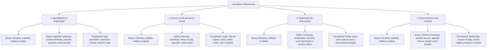

```mermaid
flowchart TD

    A[Jornada da Teleconsulta]

    A --> B[1. Agendamento e preparação]
    A --> C[2. Acesso e sala de espera virtual]
    A --> D[3. Realização da teleconsulta]
    A --> E[4. Encerramento e pós-consulta]

    B --> B1[Atores: Paciente, cuidador, médico e central]
    B --> B2[Ações: Agendar, confirmar, receber lembrete, preparar aparelho e tirar dúvidas]
    B --> B3[Touchpoints: App, push/SMS, calendário, central, tutorial e login]

    C --> C1[Atores: Paciente, cuidador, médico e suporte]
    C --> C2[Ações: Abrir app, autenticar, entrar na sala, aguardar e pedir ajuda]
    C --> C3[Touchpoints: Login, sala de espera, status, botão entrar, chat e suporte]

    D --> D1[Atores: Paciente, cuidador e médico]
    D --> D2[Ações: Conversar, compartilhar sintomas, ouvir orientações e resolver falhas]
    D --> D3[Touchpoints: Vídeo, áudio, chat, teste de som e prescrição/orientação]

    E --> E1[Atores: Paciente, cuidador, médico e central]
    E --> E2[Ações: Encerrar chamada, receber resumo, agendar retorno, avaliar e tirar dúvidas]
    E --> E3[Touchpoints: Notificação, resumo no app, receita digital, pesquisa e suporte]
```
