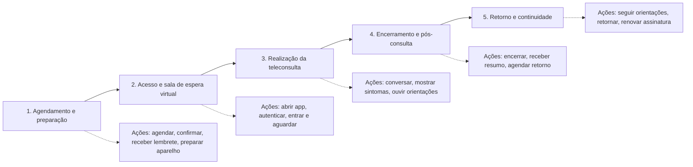
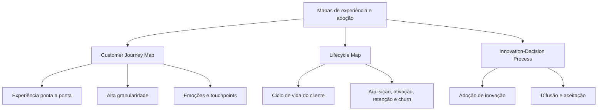
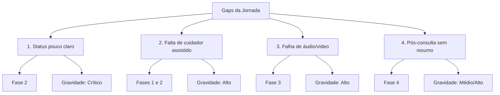

| Fase                                   | Ações                                                                  | Touchpoints                                                            | Emoções                                     | Oportunidade de melhoria                                                                                 |
| -------------------------------------- | ---------------------------------------------------------------------- | ---------------------------------------------------------------------- | ------------------------------------------- | -------------------------------------------------------------------------------------------------------- |
| **1. Agendamento e preparação**        | Agendar, confirmar, receber lembrete, preparar aparelho, tirar dúvidas | App, push/SMS, calendário, central, tutorial, login                    | Expectativa, ansiedade leve, dúvida         | Tutorial simples e lembrete com checklist do que testar antes                                            |
| **2. Acesso e sala de espera virtual** | Abrir app, autenticar, entrar na sala, aguardar, confirmar início      | Login, sala de espera, status da consulta, botão entrar, chat, suporte | Confusão, insegurança, sensação de abandono | Status claro: “Aguardando médico”, “Médico entrou”, “Consulta iniciada”, tempo estimado e botão de ajuda |
| **3. Realização da teleconsulta**      | Conversar, mostrar sintomas, ouvir orientações, testar áudio/vídeo     | Vídeo, áudio, chat, teste de som, instruções                           | Frustração se falha; alívio se funciona     | Teste automático de áudio/vídeo e fallback para ligação telefônica                                       |
| **4. Encerramento e pós-consulta**     | Encerrar chamada, receber resumo, agendar retorno, avaliar             | Notificação de fim, resumo no app, receita digital, pesquisa           | Alívio ou decepção                          | Resumo em linguagem simples, com áudio e próximos passos                                                 |
| **5. Retorno e continuidade**          | Seguir orientações, agendar retorno, renovar assinatura                | App, central, lembrete, suporte                                        | Confiança ou risco de cancelamento          | Acompanhamento pós-consulta para prevenir churn                                                          |

---

## Comparação entre mapas

| Critério          | Customer Journey Map (CJM)                                   | Lifecycle Map                                                       | Innovation-Decision Process          |
| ----------------- | ------------------------------------------------------------ | ------------------------------------------------------------------- | ------------------------------------ |
| **Objetivo**      | Mapear a experiência ponta a ponta de uma jornada específica | Mapear a relação do cliente com o serviço ao longo do ciclo de vida | Explicar como uma inovação é adotada |
| **Granularidade** | Alta: fases, ações, touchpoints, emoções                     | Média/baixa: estágios macro (aquisição, ativação, retenção, churn)  | Média: etapas cognitivas de adoção   |
| **Foco**          | Experiência operacional e emocional                          | Gestão de relacionamento e retenção                                 | Difusão e aceitação de inovação      |
| **Uso ideal**     | Redesenhar jornada e priorizar melhorias                     | Definir estratégias de ciclo de vida                                | Lançar e promover inovações          |

---

## Gaps identificados

| Gap                                                     | Momento exato                                                                               | Gravidade      |
| ------------------------------------------------------- | ------------------------------------------------------------------------------------------- | -------------- |
| **1. Falta de status claro na sala de espera virtual**  | Fase 2 — ao entrar na sala e não saber se a consulta começou                                | **Crítico**    |
| **2. Falta de modo cuidador assistido**                 | Fases 1 e 2 — idoso não consegue entrar sozinho e depende do cuidador                       | **Alto**       |
| **3. Falha de áudio/vídeo sem diagnóstico ou fallback** | Fase 3 — durante a consulta, sem saber se o problema é do aparelho do paciente ou do médico | **Alto**       |
| **4. Pós-consulta sem resumo claro e suporte**          | Fase 4 — após encerrar, sem próximos passos objetivos                                       | **Médio/Alto** |

