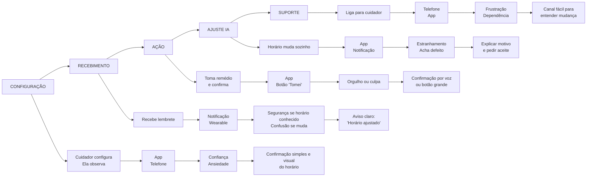
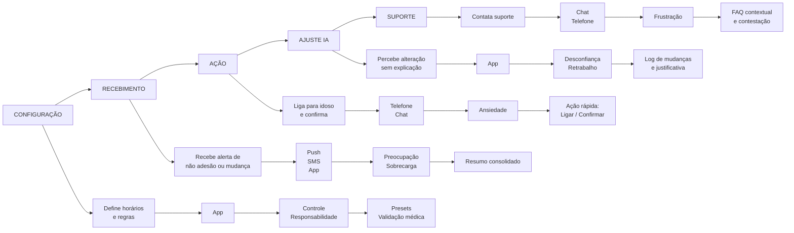
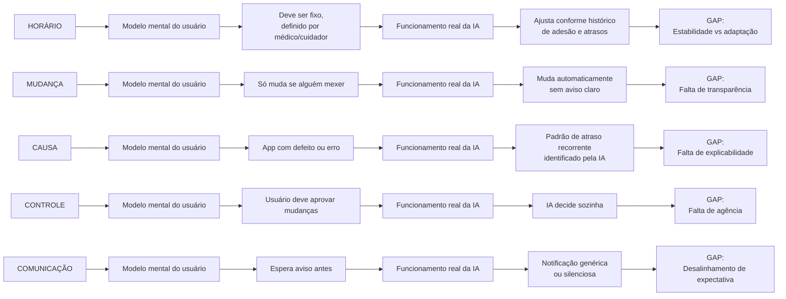
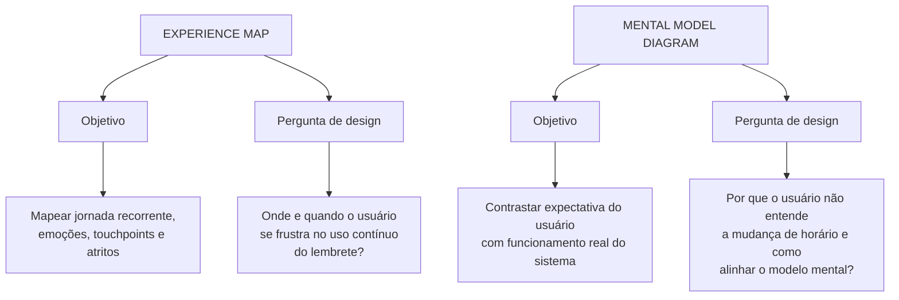

# Diagramas — Lembrete de Medicação

## 1. Experience Map — Usuário

```mermaid
flowchart LR

    A["CONFIGURAÇÃO"]
    B["RECEBIMENTO"]
    C["AÇÃO"]
    D["AJUSTE IA"]
    E["SUPORTE"]

    A1["Cuidador configura<br/>Ela observa"]
    A2["App<br/>Telefone"]
    A3["Confiança<br/>Ansiedade"]
    A4["Confirmação simples e visual<br/>do horário"]

    B1["Recebe lembrete"]
    B2["Notificação<br/>Wearable"]
    B3["Segurança se horário conhecido<br/>Confusão se muda"]
    B4["Aviso claro:<br/>'Horário ajustado'"]

    C1["Toma remédio<br/>e confirma"]
    C2["App<br/>Botão 'Tomei'"]
    C3["Orgulho ou culpa"]
    C4["Confirmação por voz<br/>ou botão grande"]

    D1["Horário muda sozinho"]
    D2["App<br/>Notificação"]
    D3["Estranhamento<br/>Acha defeito"]
    D4["Explicar motivo<br/>e pedir aceite"]

    E1["Liga para cuidador"]
    E2["Telefone<br/>App"]
    E3["Frustração<br/>Dependência"]
    E4["Canal fácil para<br/>entender mudança"]

    A --> B --> C --> D --> E

    A --> A1
    A1 --> A2 --> A3 --> A4

    B --> B1
    B1 --> B2 --> B3 --> B4

    C --> C1
    C1 --> C2 --> C3 --> C4

    D --> D1
    D1 --> D2 --> D3 --> D4

    E --> E1
    E1 --> E2 --> E3 --> E4
```

## 2. Experience Map — Cuidador

```mermaid
flowchart LR

    A["CONFIGURAÇÃO"]
    B["RECEBIMENTO"]
    C["AÇÃO"]
    D["AJUSTE IA"]
    E["SUPORTE"]

    A1["Define horários<br/>e regras"]
    A2["App"]
    A3["Controle<br/>Responsabilidade"]
    A4["Presets<br/>Validação médica"]

    B1["Recebe alerta de<br/>não adesão ou mudança"]
    B2["Push<br/>SMS<br/>App"]
    B3["Preocupação<br/>Sobrecarga"]
    B4["Resumo consolidado"]

    C1["Liga para idoso<br/>e confirma"]
    C2["Telefone<br/>Chat"]
    C3["Ansiedade"]
    C4["Ação rápida:<br/>Ligar / Confirmar"]

    D1["Percebe alteração<br/>sem explicação"]
    D2["App"]
    D3["Desconfiança<br/>Retrabalho"]
    D4["Log de mudanças<br/>e justificativa"]

    E1["Contata suporte"]
    E2["Chat<br/>Telefone"]
    E3["Frustração"]
    E4["FAQ contextual<br/>e contestação"]

    A --> B --> C --> D --> E

    A --> A1
    A1 --> A2 --> A3 --> A4

    B --> B1
    B1 --> B2 --> B3 --> B4

    C --> C1
    C1 --> C2 --> C3 --> C4

    D --> D1
    D1 --> D2 --> D3 --> D4

    E --> E1
    E1 --> E2 --> E3 --> E4
```

## 3. Mental Model Diagram

```mermaid
flowchart LR

    A["HORÁRIO"]

    A1["Modelo mental do usuário"]
    A2["Deve ser fixo,<br/>definido por médico/cuidador"]
    A3["Funcionamento real da IA"]
    A4["Ajusta conforme histórico<br/>de adesão e atrasos"]
    A5["GAP:<br/>Estabilidade vs adaptação"]

    B["MUDANÇA"]

    B1["Modelo mental do usuário"]
    B2["Só muda se alguém mexer"]
    B3["Funcionamento real da IA"]
    B4["Muda automaticamente<br/>sem aviso claro"]
    B5["GAP:<br/>Falta de transparência"]

    C["CAUSA"]

    C1["Modelo mental do usuário"]
    C2["App com defeito ou erro"]
    C3["Funcionamento real da IA"]
    C4["Padrão de atraso recorrente<br/>identificado pela IA"]
    C5["GAP:<br/>Falta de explicabilidade"]

    D["CONTROLE"]

    D1["Modelo mental do usuário"]
    D2["Usuário deve aprovar mudanças"]
    D3["Funcionamento real da IA"]
    D4["IA decide sozinha"]
    D5["GAP:<br/>Falta de agência"]

    E["COMUNICAÇÃO"]

    E1["Modelo mental do usuário"]
    E2["Espera aviso antes"]
    E3["Funcionamento real da IA"]
    E4["Notificação genérica<br/>ou silenciosa"]
    E5["GAP:<br/>Desalinhamento de expectativa"]

    A --> A1 --> A2 --> A3 --> A4 --> A5
    B --> B1 --> B2 --> B3 --> B4 --> B5
    C --> C1 --> C2 --> C3 --> C4 --> C5
    D --> D1 --> D2 --> D3 --> D4 --> D5
    E --> E1 --> E2 --> E3 --> E4 --> E5
```

## 4. Comparação dos Diagramas

```mermaid
flowchart TB

    A["EXPERIENCE MAP"]

    A1["Objetivo"]
    A2["Mapear jornada recorrente,<br/>emoções, touchpoints e atritos"]
    A3["Pergunta de design"]
    A4["Onde e quando o usuário<br/>se frustra no uso contínuo<br/>do lembrete?"]

    B["MENTAL MODEL DIAGRAM"]

    B1["Objetivo"]
    B2["Contrastar expectativa do usuário<br/>com funcionamento real do sistema"]
    B3["Pergunta de design"]
    B4["Por que o usuário não entende<br/>a mudança de horário e como<br/>alinhar o modelo mental?"]

    A --> A1 --> A2
    A --> A3 --> A4

    B --> B1 --> B2
    B --> B3 --> B4
```
