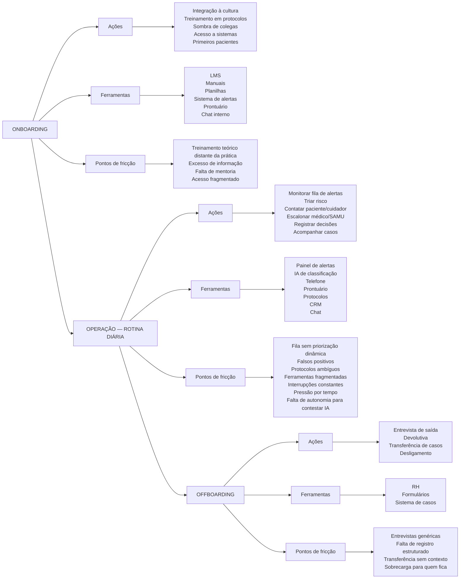
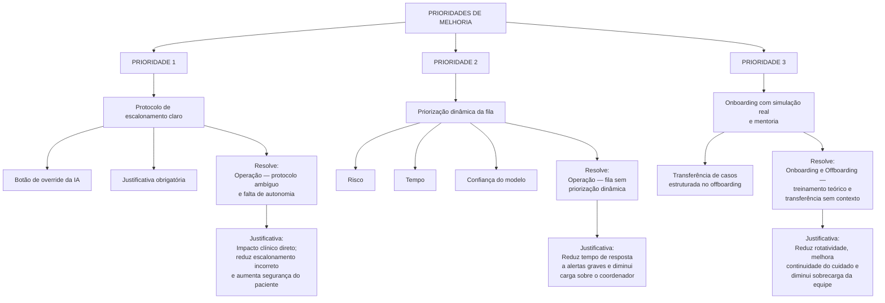

# Diagramas — Jornada da Equipe e Melhorias

## 1. Jornada da Equipe de Atendimento

```mermaid
flowchart LR

    A["ONBOARDING"]

    A1["Ações"]
    A2["Integração à cultura<br/>Treinamento em protocolos<br/>Sombra de colegas<br/>Acesso a sistemas<br/>Primeiros pacientes"]

    A3["Ferramentas"]
    A4["LMS<br/>Manuais<br/>Planilhas<br/>Sistema de alertas<br/>Prontuário<br/>Chat interno"]

    A5["Pontos de fricção"]
    A6["Treinamento teórico distante da prática<br/>Excesso de informação<br/>Falta de mentoria<br/>Acesso fragmentado"]


    B["OPERAÇÃO — ROTINA DIÁRIA"]

    B1["Ações"]
    B2["Monitorar fila de alertas<br/>Triar risco<br/>Contatar paciente/cuidador<br/>Escalonar médico/SAMU<br/>Registrar decisões<br/>Acompanhar casos"]

    B3["Ferramentas"]
    B4["Painel de alertas<br/>IA de classificação<br/>Telefone<br/>Prontuário<br/>Protocolos<br/>CRM<br/>Chat"]

    B5["Pontos de fricção"]
    B6["Fila sem priorização dinâmica<br/>Falsos positivos<br/>Protocolos ambíguos<br/>Ferramentas fragmentadas<br/>Interrupções constantes<br/>Pressão por tempo<br/>Falta de autonomia para contestar IA"]


    C["OFFBOARDING"]

    C1["Ações"]
    C2["Entrevista de saída<br/>Devolutiva<br/>Transferência de casos<br/>Desligamento"]

    C3["Ferramentas"]
    C4["RH<br/>Formulários<br/>Sistema de casos"]

    C5["Pontos de fricção"]
    C6["Entrevistas genéricas<br/>Falta de registro estruturado<br/>Transferência sem contexto<br/>Sobrecarga para quem fica"]


    A --> B --> C

    A --> A1 --> A2
    A --> A3 --> A4
    A --> A5 --> A6

    B --> B1 --> B2
    B --> B3 --> B4
    B --> B5 --> B6

    C --> C1 --> C2
    C --> C3 --> C4
    C --> C5 --> C6
```

## 2. Prioridades de Melhoria

```mermaid
flowchart TB

    A["PRIORIDADES DE MELHORIA"]

    A --> P1["PRIORIDADE 1"]

    P1 --> M1["Protocolo de escalonamento claro"]
    M1 --> M1A["Botão de override da IA"]
    M1 --> M1B["Justificativa obrigatória"]

    M1 --> R1["Resolve:<br/>Operação — protocolo ambíguo<br/>e falta de autonomia"]

    R1 --> J1["Justificativa:<br/>Impacto clínico direto;<br/>reduz escalonamento incorreto<br/>e aumenta segurança do paciente"]


    A --> P2["PRIORIDADE 2"]

    P2 --> M2["Priorização dinâmica da fila"]
    M2 --> M2A["Risco"]
    M2 --> M2B["Tempo"]
    M2 --> M2C["Confiança do modelo"]

    M2 --> R2["Resolve:<br/>Operação — fila sem<br/>priorização dinâmica"]

    R2 --> J2["Justificativa:<br/>Reduz tempo de resposta<br/>a alertas graves e diminui<br/>carga sobre o coordenador"]


    A --> P3["PRIORIDADE 3"]

    P3 --> M3["Onboarding com simulação real<br/>e mentoria"]

    M3 --> M3A["Transferência de casos<br/>estruturada no offboarding"]

    M3 --> R3["Resolve:<br/>Onboarding e Offboarding —<br/>treinamento teórico e<br/>transferência sem contexto"]

    R3 --> J3["Justificativa:<br/>Reduz rotatividade, melhora<br/>continuidade do cuidado e<br/>diminui sobrecarga da equipe"]
```
