# Roadmap Estratégico — Próximo Trimestre

## Prioridades Estratégicas

| Prioridade | Insight estratégico | Evidência nos mapas | Impacto | Viabilidade no trimestre | Requisito de produto para o roadmap |
|---|---|---|---|---|---|
| 1 | O alerta de emergência perde tempo por fila sem priorização, protocolo ambíguo e falta de registro por etapa. | Service Blueprint (Ex. 4) e jornada do coordenador (Ex. 7) | Crítico | Média | Criar fila priorizada por risco, protocolo claro de escalonamento, override da IA e timestamps por etapa. |
| 2 | A confiança do paciente despenca na sala de espera virtual da teleconsulta. | CJM e gaps emocionais (Ex. 3) | Alto | Alta | Exibir status em tempo real: “aguardando médico”, “médico entrou”, “consulta iniciada”, tempo estimado e botão de ajuda. |
| 3 | O lembrete inteligente muda horários sem explicar, quebrando o modelo mental do usuário. | Experience Map e Mental Model (Ex. 5) | Alto | Média | Notificar mudanças com motivo, histórico de ajustes e opção de aceitar, recusar ou ajustar manualmente. |
| 4 | A rotatividade dos coordenadores afeta o tempo de resposta e a taxa de escalonamento incorreto. | Jornada do coordenador (Ex. 7) | Médio/Alto | Alta | Criar onboarding simulado, mentoria e transferência estruturada de casos no offboarding. |
| 5 | A integração com farmácia exige validação clínica antes da reposição automática. | Ecossistema (Ex. 6) | Médio | Baixa | Implementar fluxo de reposição com prescrição e aprovação do médico/cuidador antes do despacho. |

## Roadmap Estratégico

```mermaid
flowchart TB

    A["INSIGHTS DOS MAPAS"]

    A --> P1["1. ALERTA DE EMERGÊNCIA"]
    P1 --> P1A["Fila priorizada por risco"]
    P1 --> P1B["Protocolo de escalonamento"]
    P1 --> P1C["Override da IA"]
    P1 --> P1D["Timestamps por etapa"]

    A --> P2["2. TELECONSULTA"]
    P2 --> P2A["Status em tempo real"]
    P2 --> P2B["Tempo estimado"]
    P2 --> P2C["Botão de ajuda"]

    A --> P3["3. LEMBRETE INTELIGENTE"]
    P3 --> P3A["Explicação da mudança"]
    P3 --> P3B["Histórico de ajustes"]
    P3 --> P3C["Aceitar, recusar ou ajustar"]

    A --> P4["4. EQUIPE DE COORDENAÇÃO"]
    P4 --> P4A["Onboarding simulado"]
    P4 --> P4B["Mentoria"]
    P4 --> P4C["Transferência estruturada"]

    A --> P5["5. INTEGRAÇÃO COM FARMÁCIA"]
    P5 --> P5A["Prescrição"]
    P5 --> P5B["Aprovação médico/cuidador"]
    P5 --> P5C["Despacho"]

    P1 --> R["ROADMAP DO PRÓXIMO TRIMESTRE"]
    P2 --> R
    P3 --> R
    P4 --> R
    P5 --> R
```

## Narrativa de abertura para o comitê

Os mapas de jornada, blueprint e ecossistema mostram que a confiança do paciente se rompe principalmente na sala de espera da teleconsulta e na resposta ao alerta de queda. O blueprint revelou que atrasos vêm de fila sem priorização, protocolo ambíguo e falta de registro por etapa.

O mapa do lembrete mostra que a IA precisa explicar mudanças e devolver controle ao usuário. O mapa do coordenador conecta rotatividade a ferramentas fragmentadas e protocolos pouco claros.

Por isso, o roadmap do próximo trimestre deve concentrar os requisitos identificados nos mapas em cinco frentes: alerta de emergência, status da teleconsulta, explicabilidade do lembrete, capacitação da equipe e integração segura com a farmácia.
