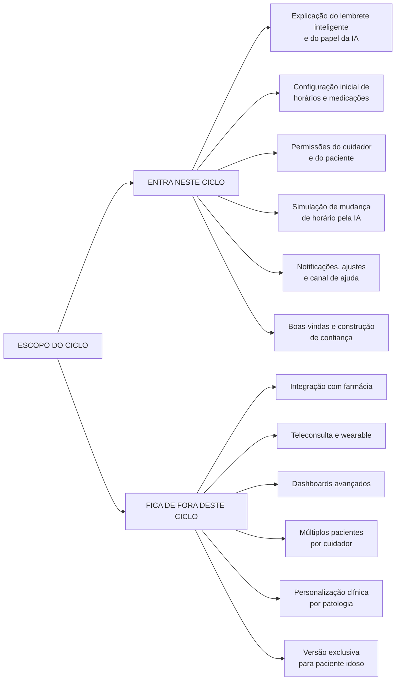
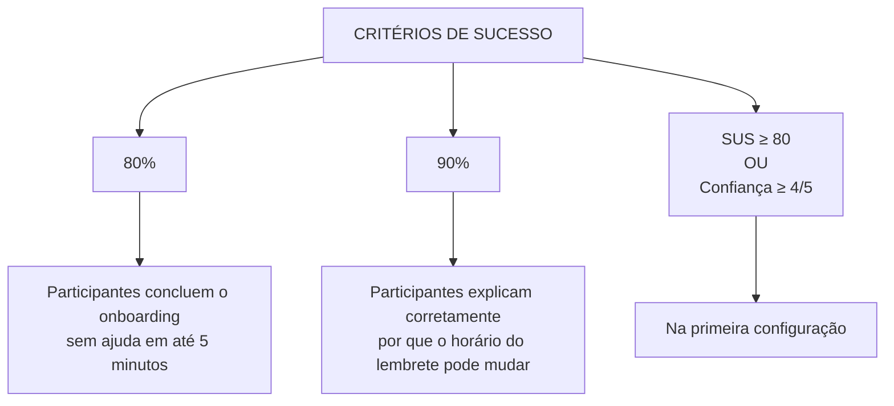
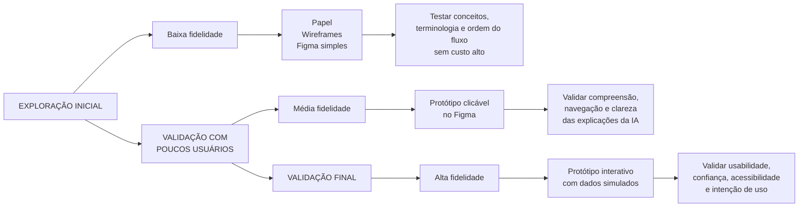

# Escopo e Prototipação

## 1. Escopo do Ciclo

### Critérios de sucesso mensuráveis

## 2. Tipo de Protótipo por Fase

| Fase | Tipo de protótipo | Justificativa |
|---|---|---|
| Exploração inicial | Baixa fidelidade: papel, wireframes ou Figma simples | Testar conceitos, terminologia e ordem do fluxo sem custo alto. |
| Validação com poucos usuários | Média fidelidade: protótipo clicável no Figma | Validar compreensão, navegação e clareza das explicações da IA. |
| Validação final | Alta fidelidade interativo com dados simulados | Validar usabilidade, confiança, acessibilidade e intenção de uso. |
