# Vitalis Care — Exercício 16: Portfólio Integrador

> Do mapa de experiência futura à apresentação final

Este portfólio reúne e organiza os principais resultados desenvolvidos ao longo do ciclo de UX da Vitalis Care.

O documento funciona como um **índice navegável** para os artefatos originais entregues. Ele não substitui os exercícios anteriores: cada decisão apresentada aqui pode ser relacionada ao exercício correspondente no repositório.

## Sumário

- [1. Visão geral](#1-visão-geral)
- [2. Índice dos artefatos](#2-índice-dos-artefatos)
- [3. Mapa de experiência futura](#3-mapa-de-experiência-futura)
- [4. Hipóteses de design](#4-hipóteses-de-design)
- [5. Alinhamento com usabilidade e confiança](#5-alinhamento-com-usabilidade-e-confiança)
- [6. User Story Mapping](#6-user-story-mapping)
- [7. Lean Startup e validação pós-lançamento](#7-lean-startup-e-validação-pós-lançamento)
- [8. Integração entre evidências e decisões](#8-integração-entre-evidências-e-decisões)
- [9. Narrativa para os stakeholders](#9-narrativa-para-os-stakeholders)
- [10. Principais decisões de design](#10-principais-decisões-de-design)
- [11. Riscos e próximas validações](#11-riscos-e-próximas-validações)
- [12. Roadmap de validação](#12-roadmap-de-validação)
- [13. Checklist do ciclo](#13-checklist-do-ciclo)
- [14. Conclusão](#14-conclusão)

---

# 1. Visão geral

A proposta deste portfólio é projetar a experiência futura dos **alertas inteligentes da Vitalis Care**, considerando a jornada completa do usuário.

O fluxo começa no lembrete de medicação, passa pelo monitoramento contínuo e pode chegar a situações de emergência, envolvendo paciente, cuidador, wearable, IA, central de atendimento e profissionais de saúde.

O trabalho busca equilibrar:

- agência e controle do usuário;
- explicabilidade das decisões da IA;
- segurança;
- fairness;
- accountability;
- inclusiveness;
- redução de falsos alarmes;
- comunicação clara;
- rastreabilidade dos eventos;
- validação contínua após o lançamento.

## Fluxo geral do trabalho

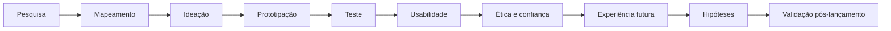

---

# 2. Índice dos artefatos

Os exercícios abaixo são os arquivos efetivamente presentes no repositório e representam as etapas utilizadas para construir a proposta final.

## 2.1 Fundamentos e mapeamento

| Exercício | Artefato | Relação com o portfólio |
|---|---|---|
| [Exercício 1](exercicio1.md) | Comparação de mapas de experiência | Define perspectivas e finalidades dos principais mapas |
| [Exercício 2](exercicio2.md) | Jornada da teleconsulta | Identifica etapas, atores, ações e pontos de contato |
| [Exercício 3](exercicio3.md) | Jornada completa da teleconsulta | Relaciona ações, emoções, touchpoints e oportunidades |
| [Exercício 4](exercicio4.md) | Service Blueprint | Mostra a relação entre experiência, atendimento e processos internos |
| [Exercício 5](exercicio5.md) | Experience Map — lembrete de medicação | Identifica dificuldades e oportunidades no uso dos lembretes |
| [Exercício 6](exercicio6.md) | Ecossistema e integrações | Representa pacientes, cuidadores, wearable, IA, central e demais atores |
| [Exercício 7](exercicio7.md) | Jornada da equipe de atendimento | Identifica necessidades, ferramentas e pontos de fricção da operação |
| [Exercício 8](exercicio8.md) | Roadmap estratégico | Organiza prioridades de produto para evolução da solução |
| [Exercício 9](exercicio9.md) | Escopo e prototipação | Define o que entra e o que fica fora do ciclo de desenvolvimento |
| [Exercício 10](exercicio10.md) | Pesquisa, requisitos e arquitetura | Conecta pesquisa exploratória aos requisitos e ao protótipo |
| [Exercício 11](exercicio11.md) | Comparação de ferramentas de prototipação | Registra decisões sobre ferramentas utilizadas |

## 2.2 Usabilidade, confiança e ética

| Exercício | Artefato | Relação com o portfólio |
|---|---|---|
| [Exercício 12](exercicio12.md) | Protótipo funcional de onboarding | Demonstra a implementação funcional do fluxo de onboarding |
| [Exercício 13](exercicio13.md) | Princípios de usabilidade | Define decisões de interface relacionadas a agência e explicabilidade |
| [Exercício 14](exercicio14.md) | Fairness, Accountability, Safety e Inclusiveness | Define riscos éticos e dimensões de confiança |

## Protótipo funcional

O repositório também possui a estrutura do protótipo:

- [Frontend](frontend/)
- [Backend](backend/)
- [README do projeto](README.md)
- [Imagem do projeto](image.png)

> Os links acima apontam somente para arquivos e diretórios existentes no repositório.

---

# 3. Mapa de experiência futura

O mapa de experiência futura consolida os principais aprendizados dos exercícios anteriores em uma jornada única de alertas inteligentes.

A proposta vai além da geração do alerta: considera a interpretação, a tomada de decisão, o atendimento, o acompanhamento e a coordenação dos cuidados.

| Fase | Experiência desejada | Hipótese de solução validada |
|---|---|---|
| Lembrete de medicação | IA ajusta horário com explicação e opção de desfazer | Onboarding com explicabilidade e controle |
| Monitoramento contínuo | Wearable envia sinais sem alarme falso excessivo | Fila priorizada e override da IA |
| Detecção de queda | Alerta chega rapidamente ao cuidador e à central | Protocolo claro e timestamps por etapa |
| Teleconsulta | Paciente sabe exatamente o status da consulta | Status em tempo real na sala de espera |
| Pós-consulta | Resumo claro e acompanhamento contínuo | Resumo em linguagem simples + suporte |
| Coordenação de cuidados | Coordenador possui ferramentas integradas e protocolo claro | Onboarding simulado e mentoria |

## Diagrama da experiência futura

```mermaid
flowchart LR
    A["Lembrete de medicação"]
    B["Monitoramento contínuo"]
    C["Detecção de queda"]
    D["Teleconsulta"]
    E["Pós-consulta"]
    F["Coordenação de cuidados"]

    A --> A1["IA ajusta horário"]
    A1 --> A2["Explicação + desfazer"]

    A2 --> B
    B --> B1["Wearable envia sinais"]
    B1 --> B2["Redução de alarmes falsos"]

    B2 --> C
    C --> C1["Alerta rápido"]
    C1 --> C2["Cuidador + central"]
    C2 --> C3["Timestamps por etapa"]

    C3 --> D
    D --> D1["Status em tempo real"]
    D1 --> D2["Sala de espera"]

    D2 --> E
    E --> E1["Resumo simples"]
    E1 --> E2["Acompanhamento contínuo"]

    E2 --> F
    F --> F1["Ferramentas integradas"]
    F1 --> F2["Protocolo claro"]
```

## Relação com os artefatos anteriores

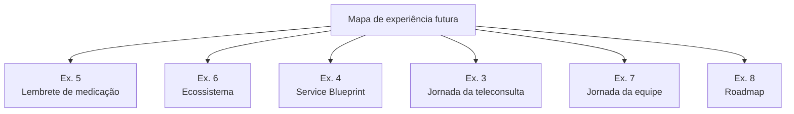

---

# 4. Hipóteses de design

As próximas validações devem seguir o formato:

> **Se fizermos X, para o público Y, esperamos o resultado Z.**

## Hipótese 1 — Controle sobre a IA

**Se** apresentarmos ao paciente e ao cuidador o motivo de cada ajuste automático de horário, com opções de aceitar, ajustar, pausar ou desfazer, **para** usuários que recebem recomendações da IA, **esperamos** aumentar a compreensão e a sensação de controle sobre as decisões automatizadas.

### Métricas

- compreensão do motivo do ajuste;
- percentual de ajustes aceitos;
- percentual de ajustes revertidos;
- quantidade de dúvidas sobre a IA.

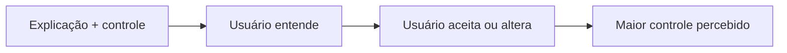

---

## Hipótese 2 — Priorização de alertas

**Se** organizarmos os alertas em uma fila priorizada por gravidade e contexto, com possibilidade de override da IA, **para** cuidadores e profissionais da central, **esperamos** reduzir o tempo necessário para identificar e tratar eventos críticos.

### Métricas

- tempo até identificação;
- tempo até atendimento;
- quantidade de falsos alarmes;
- quantidade de alertas reclassificados manualmente.

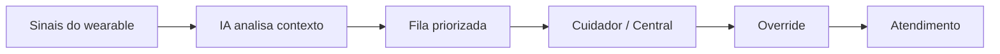

---

## Hipótese 3 — Protocolo de emergência

**Se** apresentarmos um protocolo de escalonamento com etapas, responsáveis e timestamps, **para** cuidadores e profissionais da central durante situações de emergência, **esperamos** reduzir dúvidas sobre quem deve agir e melhorar a rastreabilidade do atendimento.

### Métricas

- tempo entre etapas;
- quantidade de escalonamentos incorretos;
- quantidade de alertas sem responsável;
- compreensão do protocolo.

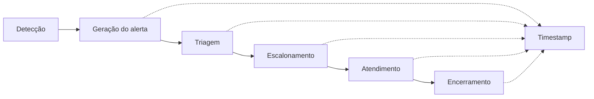

---

# 5. Alinhamento com usabilidade e confiança

O mapa futuro foi comparado aos princípios de usabilidade definidos no [Exercício 13](exercicio13.md) e aos critérios de ética e confiança definidos no [Exercício 14](exercicio14.md).

| Objetivo | Alinhamento | Inconsistência |
|---|---|---|
| Agência do usuário | O mapa inclui desfazer, ajustar e pausar | Nenhuma significativa |
| Explicabilidade | O motivo do ajuste fica visível | Falta definir um padrão visual único |
| Fairness | Diferentes grupos são considerados | O mapa ainda não detalha acessibilidade rural |
| Safety | Existe protocolo de escalonamento | Falta métrica de erro clínico diretamente ligada ao mapa |
| Inclusiveness | Linguagem simples e controles acessíveis | Necessário testar com usuários de baixa alfabetização digital |

## Diagrama de alinhamento

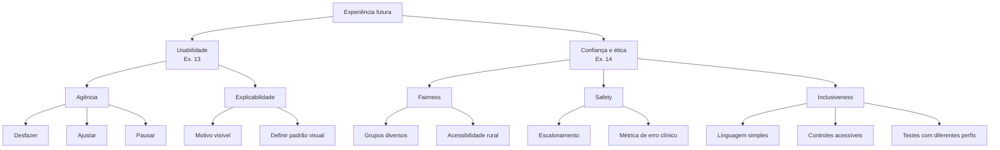

---

# 6. User Story Mapping

A evolução do recurso deve ser organizada pela experiência do usuário e não apenas pelas funcionalidades técnicas.

## Backbone da experiência

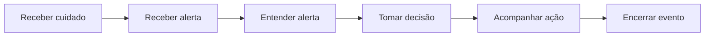

## User stories prioritárias

| Etapa | User story |
|---|---|
| Receber alerta | Como cuidador, quero receber alertas relevantes para saber quando preciso agir |
| Entender alerta | Como cuidador, quero entender por que o alerta foi gerado |
| Tomar decisão | Como cuidador, quero aceitar, ajustar ou contestar uma recomendação |
| Acompanhar ação | Como cuidador, quero saber quem está tratando o alerta |
| Encerrar evento | Como cuidador, quero registrar o encerramento para manter o histórico |

## Evolução por releases

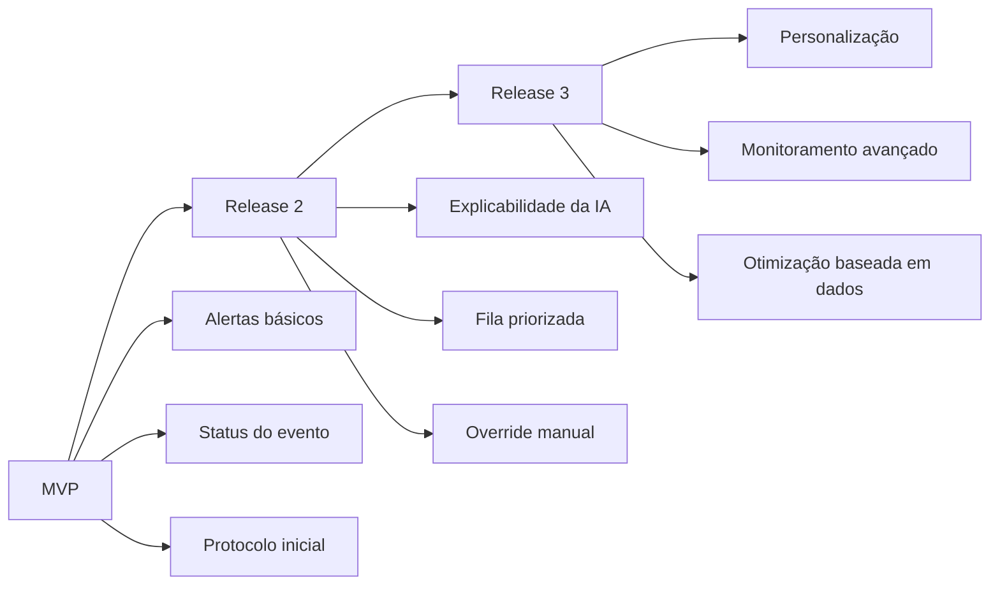

---

# 7. Lean Startup e validação pós-lançamento

A validação não termina com o lançamento.

A proposta é manter um ciclo contínuo de:

**Construir → Medir → Aprender → Ajustar**

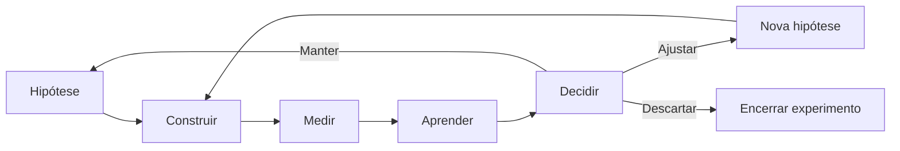

## Ciclo de validação

| Etapa | Atividade | Evidência |
|---|---|---|
| Construir | Criar pequena alteração no produto | Protótipo ou funcionalidade |
| Medir | Observar comportamento real | Métricas e eventos |
| Aprender | Comparar resultado com a hipótese | Análise dos dados |
| Decidir | Manter, ajustar ou descartar | Decisão registrada |

---

# 8. Integração entre evidências e decisões

Cada decisão de design deve estar relacionada a uma evidência produzida durante o trabalho.

| Evidência | Decisão derivada | Artefato relacionado |
|---|---|---|
| Pesquisa exploratória | Simplificar linguagem e reduzir complexidade | [Exercício 10](exercicio10.md) |
| Jornada do usuário | Melhorar comunicação durante a experiência | [Exercício 3](exercicio3.md) |
| Service Blueprint | Definir responsabilidades e escalonamento | [Exercício 4](exercicio4.md) |
| Ecossistema | Considerar relações entre atores e sistemas | [Exercício 6](exercicio6.md) |
| Jornada da equipe | Melhorar ferramentas e protocolos da operação | [Exercício 7](exercicio7.md) |
| Roadmap | Priorizar melhorias de maior impacto | [Exercício 8](exercicio8.md) |
| Escopo | Definir o que entra no ciclo | [Exercício 9](exercicio9.md) |
| Princípios de usabilidade | Garantir agência e explicabilidade | [Exercício 13](exercicio13.md) |
| Avaliação ética | Considerar fairness, accountability, safety e inclusiveness | [Exercício 14](exercicio14.md) |
| Protótipo funcional | Validar o fluxo antes de uma implementação maior | [Exercício 12](exercicio12.md) |

## Relação entre evidência e decisão

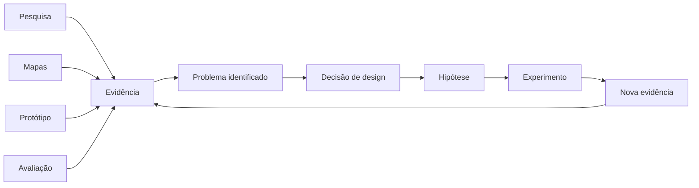

---

# 9. Narrativa para os stakeholders

## 9.1 Abertura

A Vitalis Care possui diferentes pontos de contato entre paciente, cuidador, central de atendimento, profissionais de saúde e tecnologia.

O desafio identificado durante o ciclo não é apenas gerar alertas, mas garantir que eles sejam **compreensíveis, acionáveis, seguros e adequados ao contexto do usuário**.

Por isso, a proposta final considera a experiência completa e não uma funcionalidade isolada.

---

## 9.2 O problema

Os exercícios de jornada, ecossistema e Service Blueprint mostram que um evento pode envolver diferentes pessoas e sistemas.

Um alerta pode começar com um sinal do wearable, passar pela IA, chegar ao cuidador, ser analisado pela central e terminar com um atendimento ou acompanhamento.

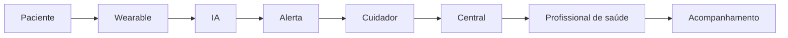

Uma falha em qualquer uma dessas etapas pode comprometer a experiência completa.

---

# 10. Principais decisões de design

## 10.1 Explicar a IA

A IA não deve apenas apresentar uma alteração.

O usuário deve conseguir entender:

- o que foi alterado;
- por que foi alterado;
- aceitar;
- ajustar;
- desfazer;
- pausar quando necessário.

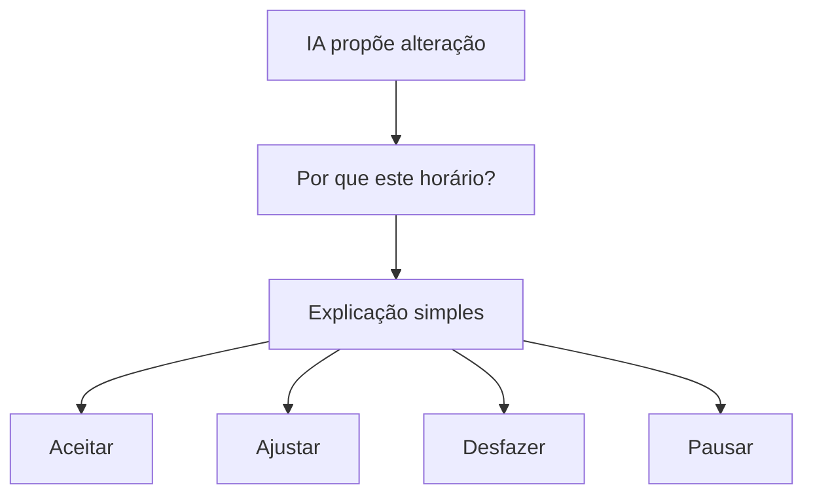

Essa decisão está diretamente relacionada aos princípios de usabilidade do [Exercício 13](exercicio13.md).

---

## 10.2 Priorizar alertas

Nem todos os eventos possuem a mesma gravidade.

A experiência futura propõe uma fila priorizada para facilitar a identificação dos eventos que exigem atenção.

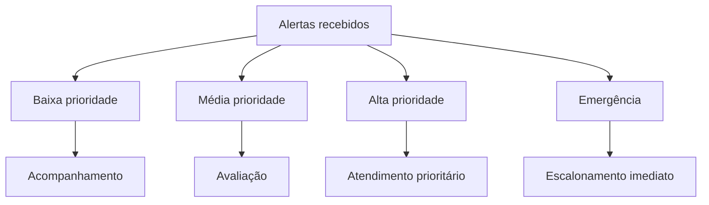

Essa decisão se relaciona principalmente ao [Exercício 4](exercicio4.md), [Exercício 7](exercicio7.md) e [Exercício 8](exercicio8.md).

---

## 10.3 Manter controle humano

A automação não elimina a necessidade de intervenção humana.

O sistema deve permitir que decisões automáticas sejam revisadas ou substituídas quando necessário.

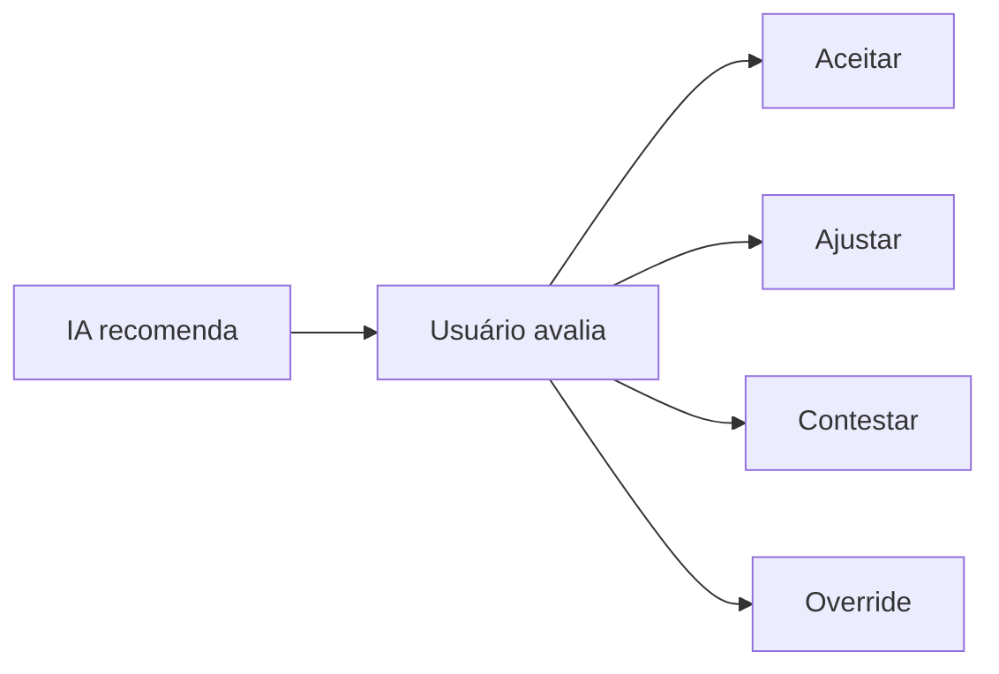

Essa decisão está relacionada aos princípios de controle e liberdade do usuário e ao framework de confiança.

---

# 11. Riscos e próximas validações

Apesar dos avanços, alguns pontos continuam como hipóteses que precisam ser validadas.

| Risco | Próxima validação |
|---|---|
| Usuário não entender a explicação da IA | Teste de compreensão |
| Excesso de alertas | Teste de carga e priorização |
| Falsos positivos | Monitoramento de eventos reais |
| Exclusão de usuários com baixa familiaridade digital | Teste com diferentes perfis |
| Desempenho diferente entre contextos | Auditoria de fairness |
| Erro em situação crítica | Simulação de emergência |
| Dependência excessiva da automação | Teste de override humano |

## Matriz de validação

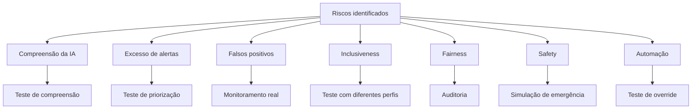

---

# 12. Roadmap de validação

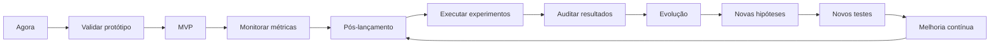

## Indicadores principais

| Área | Indicador |
|---|---|
| Agência | Taxa de ajustes e reversões |
| Explicabilidade | Compreensão do motivo do alerta |
| Safety | Tempo de resposta e erros de escalonamento |
| Fairness | Diferença de desempenho entre grupos |
| Inclusiveness | Taxa de sucesso em diferentes perfis |
| Operação | Tempo médio de tratamento |
| Confiabilidade | Taxa de falsos alarmes |

---

# 13. Checklist do ciclo

- [x] Pesquisa realizada
- [x] Jornadas mapeadas
- [x] Ecossistema identificado
- [x] Service Blueprint desenvolvido
- [x] Escopo definido
- [x] Requisitos levantados
- [x] Protótipo desenvolvido
- [x] Princípios de usabilidade definidos
- [x] Avaliação de Fairness realizada
- [x] Avaliação de Accountability realizada
- [x] Avaliação de Safety realizada
- [x] Avaliação de Inclusiveness realizada
- [x] Framework de confiança definido
- [x] Mapa de experiência futura definido
- [x] Hipóteses de design formuladas
- [x] User Story Mapping definido
- [x] Estratégia Lean Startup definida
- [x] Métricas de validação definidas

---

# 14. Conclusão

O portfólio integrador organiza os resultados do ciclo de UX da Vitalis Care em uma sequência que conecta:

**evidência → problema → decisão → hipótese → experimento → nova evidência.**

O mapa de experiência futura mostra como os alertas inteligentes podem acompanhar diferentes momentos da jornada, enquanto as hipóteses de design definem quais decisões ainda precisam ser testadas.

Os princípios de usabilidade e o framework de confiança permanecem como critérios para a evolução do produto.

A partir do lançamento, a proposta é continuar utilizando ciclos curtos de validação:

**Construir → Medir → Aprender → Ajustar.**

Dessa forma, cada nova evolução do recurso pode ser relacionada a uma evidência, testada com usuários e acompanhada por métricas antes de ser ampliada.

---

## Navegação rápida

| Se você quer entender... | Consulte |
|---|---|
| Os fundamentos dos mapas | [Exercício 1](exercicio1.md) |
| A jornada de teleconsulta | [Exercício 2](exercicio2.md) |
| A experiência completa da teleconsulta | [Exercício 3](exercicio3.md) |
| O fluxo de emergência | [Exercício 4](exercicio4.md) |
| O lembrete de medicação | [Exercício 5](exercicio5.md) |
| O ecossistema da solução | [Exercício 6](exercicio6.md) |
| A jornada da equipe | [Exercício 7](exercicio7.md) |
| O roadmap estratégico | [Exercício 8](exercicio8.md) |
| O escopo do ciclo | [Exercício 9](exercicio9.md) |
| A pesquisa e os requisitos | [Exercício 10](exercicio10.md) |
| As ferramentas de prototipação | [Exercício 11](exercicio11.md) |
| O protótipo funcional | [Exercício 12](exercicio12.md) |
| Os princípios de usabilidade | [Exercício 13](exercicio13.md) |
| Os riscos éticos e confiança | [Exercício 14](exercicio14.md) |
| O código e execução do protótipo | [README.md](README.md) |
| O frontend do protótipo | [frontend](frontend/) |
| O backend do protótipo | [backend](backend/) |

---

## Repositório

[Repositório completo no GitHub](https://github.com/sanfergio/at-ux-infnet)

## Projeto

**Vitalis Care**

**Exercício 16 — Portfólio integrador**

Projeto acadêmico de UX, pesquisa, prototipação, avaliação ética e evolução de produto.

> Código, documentação e artefatos elaborados com apoio de IA e revisados pelo autor.
