# Vitalis Care — Exercício 16: Portfólio Integrador

> **Do mapa de experiência futura à apresentação final**

O Exercício 16 reúne os principais resultados desenvolvidos ao longo do ciclo de UX da Vitalis Care.

Este documento **não substitui os artefatos originais**. Ele funciona como um **índice navegável**, conectando pesquisas, mapas, protótipos, avaliações, testes e decisões de design em uma única narrativa.

---

## 1. Visão geral

A proposta do portfólio é projetar a experiência futura dos **alertas inteligentes da Vitalis Care**, considerando toda a jornada do usuário, desde o lembrete de medicação até situações de emergência.

A construção da proposta considera os seguintes pontos:

- agência e controle do usuário;
- explicabilidade das decisões da IA;
- segurança clínica;
- inclusão e acessibilidade;
- redução de falsos alarmes;
- comunicação clara entre paciente, cuidador e central;
- acompanhamento após eventos;
- validação contínua após o lançamento.

### Fluxo geral do portfólio

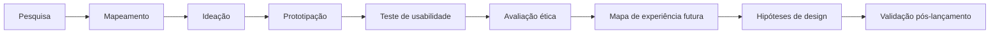

---

# 2. Índice navegável dos artefatos

A estrutura abaixo permite acessar os artefatos originais utilizados durante o desenvolvimento do trabalho.

## 2.1 Pesquisa e descoberta

| Artefato | Objetivo |
|---|---|
| [Evidências de pesquisa](./evidencias-pesquisa.md) | Registrar evidências coletadas durante a pesquisa |
| [Mapa de Empatia](./mapa-empatia.md) | Identificar dores, necessidades, comportamentos e expectativas |
| [Jornada do Usuário](./jornada/mapa-jornada.md) | Representar a experiência do paciente/cuidador |
| [Mental Model](./mental-model.md) | Relacionar expectativas do usuário com funcionalidades do sistema |

## 2.2 Mapeamento da experiência

| Artefato | Objetivo |
|---|---|
| [Experience Map — Usuário](./experience-map-usuario.md) | Mapear a experiência do usuário |
| [Experience Map — Cuidador](./experience-map-cuidador.md) | Mapear a experiência do cuidador |
| [Ecosystem Map](./ecosystem-map.md) | Representar atores, sistemas e relações do ecossistema |
| [Service Blueprint](./service-blueprint.md) | Relacionar experiência visível e processos internos |
| [Mapa de oportunidades e fricções](./oportunidades-friccoes.md) | Identificar oportunidades de melhoria |

## 2.3 Coordenação de cuidados

| Artefato | Objetivo |
|---|---|
| [Jornada do Coordenador](./jornada-coordenador.md) | Representar onboarding, operação e offboarding |
| [Prioridades do Coordenador](./prioridades-coordenador.md) | Registrar necessidades e prioridades identificadas |
| [Roadmap estratégico](./roadmap.md) | Organizar evolução das soluções |

## 2.4 Prototipação

| Artefato | Objetivo |
|---|---|
| [Arquitetura do protótipo](./prototipo-arquitetura.md) | Definir estrutura das telas |
| [Requisitos da interface](./requisitos-interface.md) | Registrar requisitos derivados da pesquisa |
| [Protótipo de onboarding](./README.md) | Protótipo funcional do onboarding do cuidador |
| [Comparação de ferramentas de prototipação](./comparacao-ferramentas.md) | Comparar ferramentas utilizadas e alternativas |

## 2.5 Ética, confiança e usabilidade

| Artefato | Objetivo |
|---|---|
| [Fairness, Accountability, Safety e Inclusiveness](./fairness-accountability-safety-inclusiveness.md) | Identificar riscos éticos |
| [Framework de confiança](./framework-confianca.md) | Definir critérios observáveis de confiança |
| [Princípios de usabilidade](./principios-usabilidade.md) | Relacionar princípios com decisões concretas de interface |
| [Teste de usabilidade](./teste-usabilidade.md) | Registrar achados e oportunidades encontradas |

---

# 3. Mapa de experiência futura — alertas inteligentes

O mapa futuro representa a jornada completa de alertas inteligentes da Vitalis Care.

A experiência desejada não considera somente a geração do alerta, mas também a comunicação, a tomada de decisão, o acompanhamento e a participação dos diferentes envolvidos.

| Fase | Experiência desejada | Hipótese de solução validada |
|---|---|---|
| Lembrete de medicação | IA ajusta horário com explicação e opção de desfazer | Onboarding com explicabilidade e controle |
| Monitoramento contínuo | Wearable envia sinais sem alarme falso excessivo | Fila priorizada e override da IA |
| Detecção de queda | Alerta chega rapidamente ao cuidador e à central | Protocolo claro e timestamps por etapa |
| Teleconsulta | Paciente sabe exatamente o status da consulta | Status em tempo real na sala de espera |
| Pós-consulta | Resumo claro e acompanhamento contínuo | Resumo em linguagem simples + suporte |
| Coordenação de cuidados | Coordenador possui ferramentas integradas e protocolo claro | Onboarding simulado e mentoria |

### Diagrama da experiência futura

```mermaid
flowchart LR
    A["Lembrete de medicação"]
    B["Monitoramento contínuo"]
    C["Detecção de queda"]
    D["Teleconsulta"]
    E["Pós-consulta"]
    F["Coordenação de cuidados"]

    A --> A1["IA ajusta horário"]
    A1 --> A2["Explicação + desfazer"]

    A2 --> B
    B --> B1["Wearable envia sinais"]
    B1 --> B2["Redução de alarmes falsos"]

    B2 --> C
    C --> C1["Alerta rápido"]
    C1 --> C2["Cuidador + central"]
    C2 --> C3["Timestamps por etapa"]

    C3 --> D
    D --> D1["Status em tempo real"]
    D1 --> D2["Sala de espera"]

    D2 --> E
    E --> E1["Resumo simples"]
    E1 --> E2["Acompanhamento contínuo"]

    E2 --> F
    F --> F1["Ferramentas integradas"]
    F1 --> F2["Protocolo claro"]
```

---

# 4. Hipóteses de design para os próximos experimentos

As próximas validações devem utilizar hipóteses tripartidas:

> **Se fizermos X, para o público Y, esperamos o resultado Z.**

## Hipótese 1 — Controle sobre a IA

**Se** apresentarmos ao paciente e ao cuidador o motivo de cada ajuste automático de horário, com opções de **aceitar, ajustar, pausar ou desfazer**, **para** usuários que recebem recomendações da IA, **esperamos** aumentar a compreensão e a sensação de controle sobre as decisões automatizadas.

### Métrica sugerida

- compreensão do motivo do ajuste;
- percentual de ajustes aceitos;
- percentual de ajustes revertidos;
- quantidade de dúvidas sobre o funcionamento da IA.

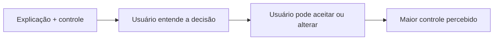

---

# 5. Hipótese 2 — Priorização de alertas

**Se** organizarmos os alertas em uma fila priorizada por gravidade e contexto, com possibilidade de **override da IA**, **para** cuidadores e profissionais da central, **esperamos** reduzir o tempo necessário para identificar e tratar eventos realmente críticos.

### Métrica sugerida

- tempo médio até a identificação;
- tempo médio até o atendimento;
- quantidade de falsos alarmes;
- quantidade de alertas reclassificados manualmente.

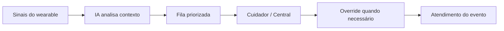

---

# 6. Hipótese 3 — Protocolo de emergência

**Se** apresentarmos um protocolo de escalonamento com etapas, responsáveis e timestamps, **para** cuidadores e profissionais da central durante uma situação de emergência, **esperamos** reduzir dúvidas sobre quem deve agir e melhorar a rastreabilidade do atendimento.

### Métrica sugerida

- tempo entre cada etapa;
- quantidade de escalonamentos incorretos;
- quantidade de alertas sem responsável;
- compreensão do protocolo durante testes.

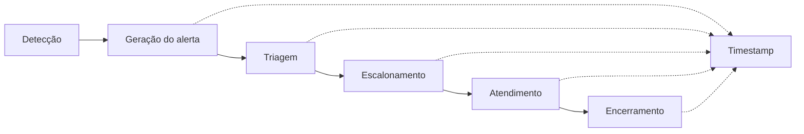

---

# 7. Alinhamento com os Exercícios 13 e 14

O mapa de experiência futura foi comparado com os objetivos de usabilidade e confiança definidos anteriormente.

| Objetivo | Alinhamento | Inconsistência |
|---|---|---|
| Agência do usuário — Ex. 13 | Mapa inclui desfazer, ajustar e pausar | Nenhuma significativa |
| Explicabilidade — Ex. 13 | Motivo do ajuste fica visível | Falta definir um padrão visual único |
| Fairness — Ex. 14 | Grupos diversos são considerados na auditoria | O mapa ainda não detalha acessibilidade rural |
| Safety — Ex. 14 | Existe protocolo de escalonamento | Falta uma métrica de erro clínico diretamente ligada ao mapa |
| Inclusiveness — Ex. 14 | Linguagem simples e controles acessíveis | Necessário testar com usuários de baixa alfabetização digital |

### Diagrama de alinhamento

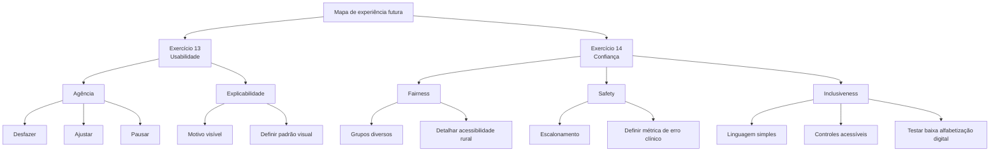

---

# 8. Princípios de user story mapping

A evolução do recurso deve ser organizada pelas necessidades do usuário, e não apenas pelas funcionalidades técnicas.

## Backbone da experiência

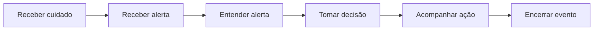

## User stories prioritárias

| Etapa | User story |
|---|---|
| Receber alerta | Como cuidador, quero receber alertas relevantes para saber quando preciso agir |
| Entender alerta | Como cuidador, quero entender por que o alerta foi gerado |
| Tomar decisão | Como cuidador, quero aceitar, ajustar ou contestar uma recomendação |
| Acompanhar ação | Como cuidador, quero saber quem está tratando o alerta |
| Encerrar evento | Como cuidador, quero registrar o encerramento para manter o histórico |

### Evolução por releases

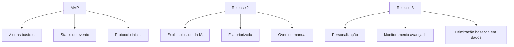

---

# 9. Estratégia Lean Startup após o lançamento

A validação não termina com o lançamento.

A proposta é manter um ciclo contínuo de:

**Construir → Medir → Aprender → Ajustar**

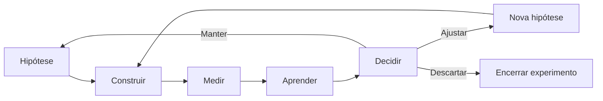

## Ciclo de validação

| Etapa | Atividade | Evidência |
|---|---|---|
| Construir | Criar pequena alteração no produto | Protótipo ou funcionalidade |
| Medir | Observar comportamento real | Métricas e eventos |
| Aprender | Comparar resultado com a hipótese | Análise dos dados |
| Decidir | Manter, ajustar ou descartar | Decisão registrada |

---

# 10. Validação iterativa pós-lançamento

A evolução do recurso deve utilizar experimentos pequenos e mensuráveis.

## Indicadores principais

| Área | Indicador |
|---|---|
| Agência | Taxa de ajustes e reversões |
| Explicabilidade | Compreensão do motivo do alerta |
| Safety | Tempo de resposta e erros de escalonamento |
| Fairness | Diferença de desempenho entre grupos |
| Inclusiveness | Taxa de sucesso em diferentes perfis de usuário |
| Operação | Tempo médio de tratamento |
| Confiabilidade | Taxa de falsos alarmes |

### Ciclo de melhoria

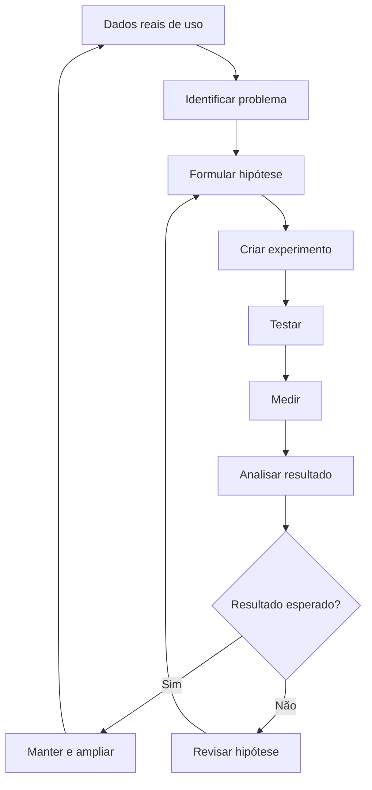

---

# 11. Integração das evidências

Cada decisão de design deve estar relacionada a uma evidência produzida durante o trabalho.

| Evidência | Decisão derivada |
|---|---|
| Pesquisa com usuários | Simplificar linguagem e reduzir complexidade |
| Jornada do cuidador | Melhorar comunicação durante eventos |
| Service Blueprint | Definir responsabilidades e escalonamento |
| Mental Model | Tornar o funcionamento da IA compreensível |
| Teste de usabilidade | Ajustar elementos de interface e fluxo |
| Framework de confiança | Registrar, explicar e permitir contestação |
| Avaliação de fairness | Considerar diferentes perfis e contextos |
| Avaliação de safety | Priorizar segurança em decisões automáticas |
| Avaliação de inclusiveness | Utilizar linguagem simples e controles acessíveis |
| Protótipo | Validar fluxos antes da implementação |

### Relação entre evidência e decisão

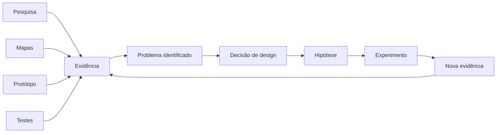

---

# 12. Arquitetura do portfólio

O portfólio deve permitir que um stakeholder entre pelo problema, encontre a evidência e chegue à decisão correspondente.

```mermaid
flowchart TD
    A["Portfólio Integrador"]

    A --> B["01 Pesquisa"]
    A --> C["02 Mapeamento"]
    A --> D["03 Ideação"]
    A --> E["04 Protótipo"]
    A --> F["05 Testes"]
    A --> G["06 Ética e confiança"]
    A --> H["07 Experiência futura"]
    A --> I["08 Próximos experimentos"]

    B --> B1["Evidências"]
    B --> B2["Entrevistas"]

    C --> C1["Jornada"]
    C --> C2["Experience Map"]
    C --> C3["Ecosystem Map"]
    C --> C4["Service Blueprint"]

    D --> D1["Oportunidades"]
    D --> D2["Requisitos"]

    E --> E1["Protótipo"]
    E --> E2["Onboarding"]

    F --> F1["Achados"]
    F --> F2["Usabilidade"]

    G --> G1["Fairness"]
    G --> G2["Accountability"]
    G --> G3["Safety"]
    G --> G4["Inclusiveness"]
    G --> G5["Framework de confiança"]

    H --> H1["Mapa futuro"]
    H --> H2["Hipóteses"]

    I --> I1["User Story Mapping"]
    I --> I2["Lean Startup"]
    I --> I3["Métricas"]
```

---

# 13. Narrativa de apresentação para os stakeholders

## 13.1 Abertura

A Vitalis Care possui diferentes pontos de contato entre paciente, cuidador, central de atendimento, profissionais de saúde e tecnologia.

O desafio identificado ao longo do trabalho não é apenas gerar alertas, mas garantir que esses alertas sejam **compreensíveis, acionáveis, seguros e adequados ao contexto do usuário**.

Por isso, a proposta final parte da experiência completa e não de uma funcionalidade isolada.

---

## 13.2 O problema

Os artefatos de pesquisa e mapeamento mostram que a experiência envolve diferentes momentos e atores.

Um alerta pode começar com um sinal do wearable, passar pela IA, chegar ao cuidador, ser escalado para uma central e terminar com um atendimento ou acompanhamento.

Isso significa que uma falha em qualquer etapa pode comprometer a experiência completa.

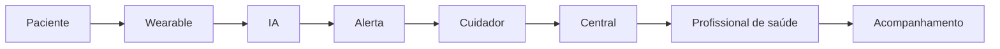

---

# 14. Decisões principais de design

## Decisão 1 — Explicar a IA

A IA não deve apenas apresentar uma mudança de horário.

O usuário deve conseguir entender:

- o que foi alterado;
- por que foi alterado;
- aceitar a alteração;
- ajustar a decisão;
- desfazer a alteração.

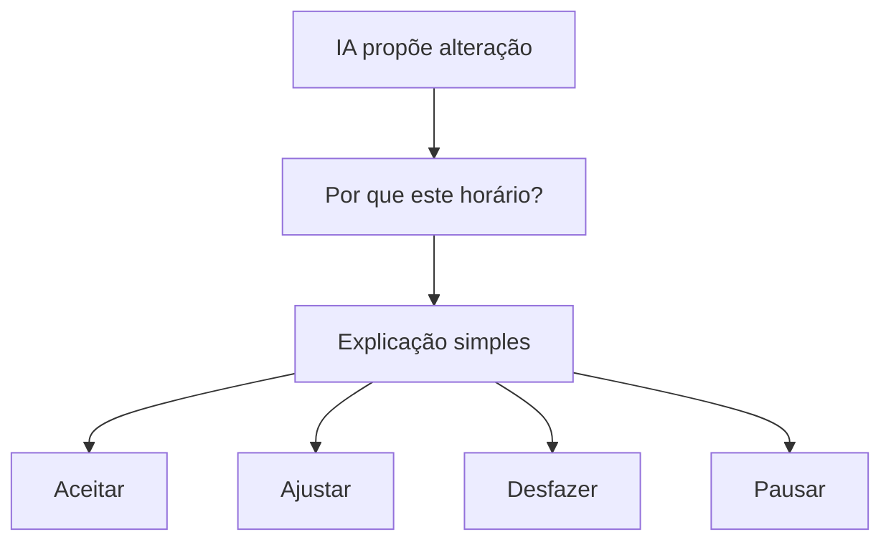

---

## Decisão 2 — Priorizar alertas

Nem todos os eventos possuem a mesma gravidade.

A proposta é utilizar uma fila priorizada para que o cuidador ou profissional consiga identificar rapidamente quais eventos exigem atenção.

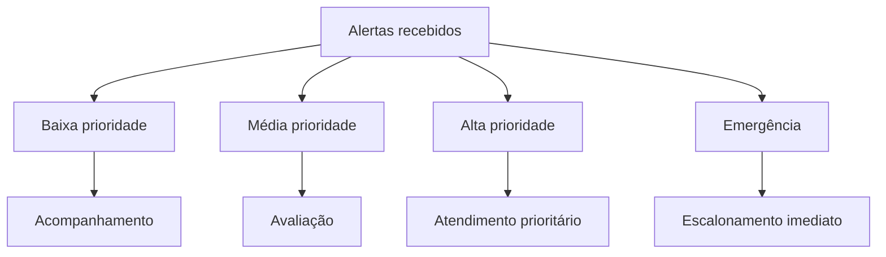

---

## Decisão 3 — Manter controle humano

A automação não elimina a necessidade de intervenção humana.

Por isso, o sistema deve permitir que decisões automáticas sejam revisadas ou substituídas quando necessário.

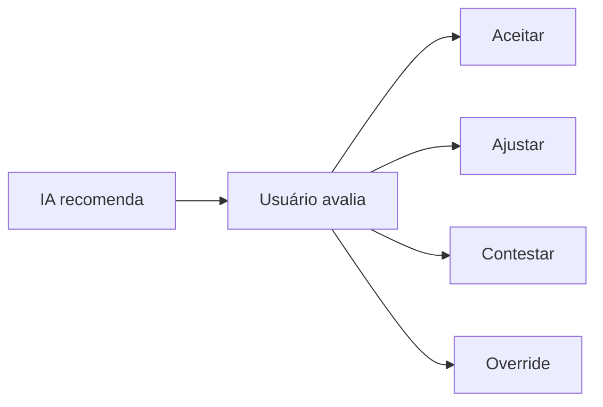

---

# 15. Riscos ainda existentes

Apesar dos avanços, alguns pontos continuam como hipóteses que precisam de validação.

| Risco | Próxima validação |
|---|---|
| Usuário não entender a explicação da IA | Teste de compreensão |
| Excesso de alertas | Teste de carga e priorização |
| Falsos positivos | Monitoramento de eventos reais |
| Exclusão de usuários com baixa familiaridade digital | Teste com diferentes perfis |
| Desempenho diferente entre contextos | Auditoria de fairness |
| Erro em situação crítica | Simulação de emergência |
| Dependência excessiva da automação | Teste de override humano |

---

# 16. Roadmap de validação

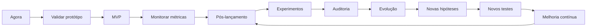

---

# 17. Critérios para os próximos experimentos

Antes de ampliar qualquer recurso de IA, devem ser acompanhados:

1. compreensão do usuário;
2. capacidade de contestar decisões;
3. segurança das recomendações;
4. taxa de falsos alarmes;
5. tempo de resposta;
6. diferenças de desempenho entre grupos;
7. acessibilidade;
8. satisfação dos cuidadores e profissionais.

---

# 18. Checklist de encerramento do ciclo

- [x] Pesquisa realizada
- [x] Jornada mapeada
- [x] Ecossistema identificado
- [x] Service Blueprint desenvolvido
- [x] Requisitos definidos
- [x] Protótipo desenvolvido
- [x] Teste de usabilidade realizado
- [x] Avaliação de confiança realizada
- [x] Riscos de Fairness identificados
- [x] Riscos de Accountability identificados
- [x] Riscos de Safety identificados
- [x] Riscos de Inclusiveness identificados
- [x] Mapa de experiência futura definido
- [x] Hipóteses de design formuladas
- [x] Estratégia Lean Startup definida
- [x] Estratégia de User Story Mapping definida
- [x] Próximas métricas definidas

---

# 19. Conclusão

O portfólio integrador organiza os resultados do ciclo de UX da Vitalis Care em uma sequência que conecta **evidência, problema, decisão, hipótese e validação**.

O mapa de experiência futura mostra como os alertas inteligentes podem acompanhar toda a jornada, enquanto as hipóteses de design definem quais decisões ainda precisam ser testadas.

Os princípios de usabilidade e o framework de confiança também permanecem como critérios para a evolução do produto.

A partir do lançamento, a proposta é continuar utilizando ciclos curtos de validação:

**Construir → Medir → Aprender → Ajustar.**

Dessa forma, cada nova evolução do recurso pode ser relacionada a uma evidência e validada antes de ser ampliada.

---

# 20. Navegação rápida

| Se você quer entender... | Consulte |
|---|---|
| O problema dos usuários | [Pesquisa e Evidências](./evidencias-pesquisa.md) |
| A jornada do usuário | [Jornada](./jornada/mapa-jornada.md) |
| O ecossistema | [Ecosystem Map](./ecosystem-map.md) |
| Os processos internos | [Service Blueprint](./service-blueprint.md) |
| As necessidades do usuário | [Mapa de Empatia](./mapa-empatia.md) |
| A arquitetura da solução | [Requisitos e Protótipo](./prototipo-arquitetura.md) |
| O protótipo funcional | [Protótipo de Onboarding](./README.md) |
| Os problemas encontrados nos testes | [Teste de Usabilidade](./teste-usabilidade.md) |
| Os riscos éticos | [Fairness, Accountability, Safety e Inclusiveness](./fairness-accountability-safety-inclusiveness.md) |
| Os critérios de confiança | [Framework de Confiança](./framework-confianca.md) |
| A experiência futura | [Mapa de Experiência Futura](#3-mapa-de-experiência-futura--alertas-inteligentes) |
| As próximas hipóteses | [Hipóteses de Design](#4-hipóteses-de-design-para-os-próximos-experimentos) |
| A estratégia pós-lançamento | [Lean Startup](#9-estratégia-lean-startup-após-o-lançamento) |

---

## Projeto

**Vitalis Care**

**Exercício 16 — Portfólio integrador**

Projeto acadêmico de UX e desenvolvimento de produto.

> Código, documentação e artefatos elaborados com apoio de IA e revisados pelo autor.
